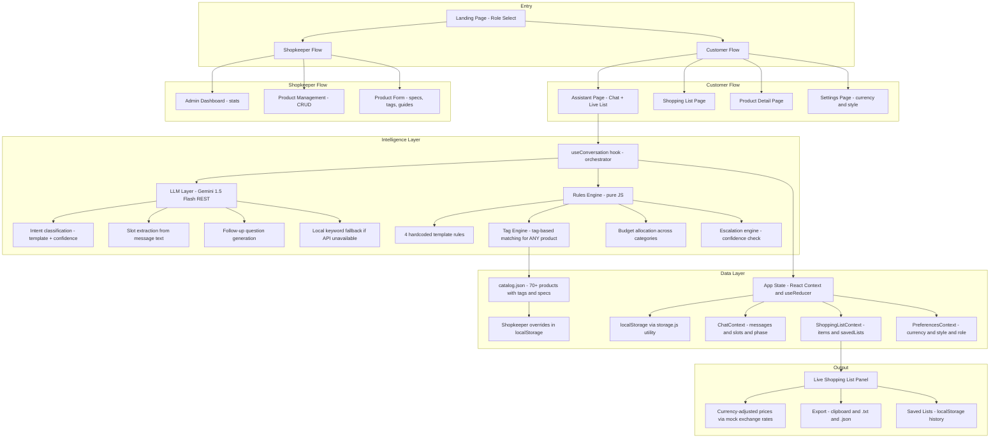

# Architecture

## System Architecture Diagram (v2 — Enterprise Expansion)

## Data Flow Summary

### Customer Flow
1. User selects "Customer" on landing → `/customer/assistant`
2. User types a message → `useConversation.sendMessage()`
3. Orchestrator calls Gemini to classify intent → `template` + `confidence` + initial `slots`
4. Gemini (or local fallback) extracts slots from each message
5. Escalation engine checks confidence threshold → escalation banner if triggered
6. Missing required slots → Gemini generates follow-up question → back to step 2
7. All slots filled → Rules engine (hardcoded) + Tag engine (shopkeeper products) compute items
8. Items dispatched to ShoppingListContext → list panel fills in live
9. User can view product detail, adjust currency in Settings, save/export list

### Shopkeeper Flow
1. User selects "Shopkeeper" on landing → `/shopkeeper/dashboard`
2. Dashboard shows catalog stats + most-recommended products (computed from saved lists)
3. Product Management: search/filter catalog, add/edit/delete, import/export JSON
4. Product Form: name, category, price, stock, imageUrl, specs (key-value), tags (fits-for), usage guide (steps), troubleshooting (issue-solution), related/alternative products
5. New products with appropriate tags become immediately recommendable — no code changes needed
6. Import JSON: bulk-load products; Export JSON: full catalog backup

## Component Table

| File | Type | Responsibility |
|---|---|---|
| `src/main.jsx` | Entry | Providers + BrowserRouter + migrations |
| `src/App.jsx` | Router | React Router route definitions |
| `src/pages/LandingPage.jsx` | Page | Role selection (Customer / Shopkeeper) |
| `src/pages/customer/CustomerLayout.jsx` | Layout | Customer nav shell |
| `src/pages/customer/AssistantPage.jsx` | Page | Two-pane chat + live list |
| `src/pages/customer/ShoppingListPage.jsx` | Page | Full-screen shopping list |
| `src/pages/customer/ProductDetailPage.jsx` | Page | Full specs, usage guide, troubleshooting |
| `src/pages/customer/SettingsPage.jsx` | Page | Currency + style preference |
| `src/pages/shopkeeper/ShopkeeperLayout.jsx` | Layout | Shopkeeper sidebar shell |
| `src/pages/shopkeeper/AdminDashboard.jsx` | Page | Catalog stats + recommendation analytics |
| `src/pages/shopkeeper/ProductManagement.jsx` | Page | Product list, search, delete, import/export |
| `src/pages/shopkeeper/ProductForm.jsx` | Page | Add/edit product with all fields |
| `src/context/ChatContext.jsx` | Context | Chat state machine |
| `src/context/ShoppingListContext.jsx` | Context | Current and saved shopping lists |
| `src/context/PreferencesContext.jsx` | Context | Currency, style, role |
| `src/hooks/useConversation.js` | Hook | Orchestrates LLM + engine + state transitions |
| `src/services/geminiApi.js` | Service | Gemini 1.5 Flash REST wrapper |
| `src/services/llmService.js` | Service | LLM interface with try/catch + fallbacks |
| `src/services/llmFallbacks.js` | Service | Keyword + regex fallbacks |
| `src/engine/recommendationEngine.js` | Engine | Hardcoded rules + tag engine hybrid |
| `src/engine/tagEngine.js` | Engine | Tag-based matching, budget allocation |
| `src/engine/escalationEngine.js` | Engine | Confidence-based escalation |
| `src/engine/rules/diningTable.js` | Rules | Dining table quantities |
| `src/engine/rules/tvMount.js` | Rules | TV mount selection |
| `src/engine/rules/livingRoom.js` | Rules | Living room furnishing |
| `src/engine/rules/gamingPc.js` | Rules | Gaming PC budget tiers |
| `src/data/catalog.json` | Data | 70+ products with tags, specs, guides |
| `src/data/templates.js` | Data | 5 project templates with slot definitions |
| `src/data/catalogUtils.js` | Data | Merged catalog (bundled + admin overrides) |
| `src/data/currency.js` | Data | formatPrice, convertPrice, getCurrencyList |
| `src/data/exchangeRates.json` | Data | Mock exchange rates (GBP base) |
| `src/utils/storage.js` | Util | JSON-safe localStorage helpers |
| `src/utils/migrations.js` | Util | Schema versioning + migration on startup |
| `src/utils/constants.js` | Util | Storage key names + schema version |

## Storage Schema (v2)

### localStorage keys

| Key | Purpose |
|---|---|
| `sra_schema_version` | Schema version integer — triggers migration on version mismatch |
| `sra_session` | Current chat session (messages, slots, phase, escalation) |
| `sra_shopping_lists` | Array of saved shopping lists |
| `sra_catalog_overrides` | Array of admin-added/edited products (merged with catalog.json at runtime) |
| `sra_preferences` | User preferences: currency, style |
| `sra_role` | Current role: customer or shopkeeper |

## Security Note

Role selection is a **UI convenience only** — there is no authentication or access control. Selecting "Shopkeeper" is a local UI state toggle. This is appropriate for a demo/hackathon submission where the goal is to demonstrate knowledge-preservation workflows, not to build a production auth system.
